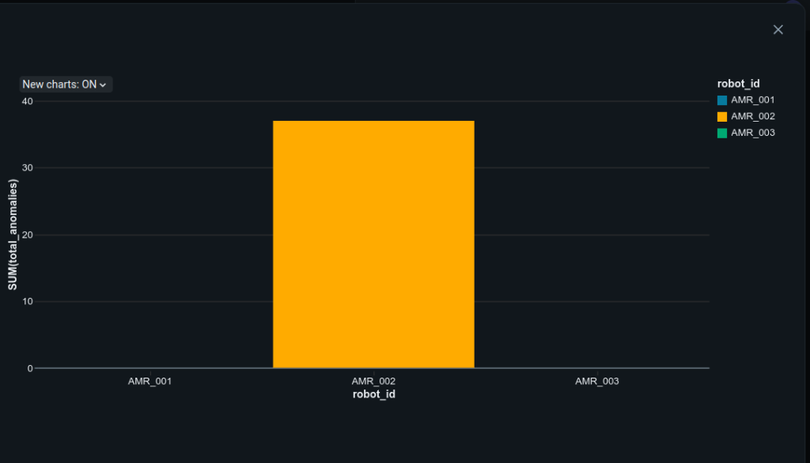

# AMR-Fleet-Health-Monitoring-Pipeline 🤖📊

A scalable data engineering pipeline built on **Databricks** and **PySpark** to monitor, analyze, and detect anomalies in Autonomous Mobile Robot (AMR) fleets.

## 🚀 Tech Stack
- **Language:** Python (PySpark)
- **Platform:** Databricks
- **Storage:** Delta Lake (Bronze/Silver architecture)
- **Libraries:** Pandas, NumPy, PySpark SQL

## 🛠️ Pipeline Features
- **Real-time Simulation:** Generates synthetic telemetry logs (battery, temperature, status) for multiple AMRs.
- **Delta Lake Integration:** Persists raw and processed data in Delta tables for reliability and performance.
- **Anomaly Detection:** Uses PySpark Window functions to calculate temperature deltas and flag sudden spikes (potential motor issues).
## 📊 Analysis Results
The following visualization showcases the aggregated anomalies detected by the pipeline. In our simulation, **AMR_002** was programmed with a hidden motor issue, which the pipeline successfully identified via temperature spikes.

> **Insight:** The high count of alerts for `AMR_002` signals a critical maintenance requirement, demonstrating the pipeline's effectiveness in predictive monitoring.

## 📈 Future Enhancements
- Integration with live IoT telemetry streams.
- ML-based predictive maintenance scoring.
- Dashboard visualization using Databricks SQL.

